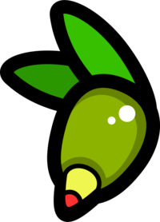

# Rust Bindings to olive.c

**IMPORTANT! THIS LIBRARY IS A WORK IN PROGRESS! ANYTHING CAN CHANGE AT ANY MOMENT WITHOUT ANY NOTICE! USE THIS LIBRARY AT YOUR OWN RISK!**

These are bindgen-generated rust bindings for olive.c.

Simple graphics library that does not have any dependencies and renders everything into the given memory pixel by pixel.

Visit [https://tsoding.github.io/olive.c/](https://tsoding.github.io/olive.c/) to see some demos.

The library is not concerned with displaying the image. It only fills up the memory with pixels. It's up to you what to do with those pixels.

The name is pronounced as "olivets'" which is a Ukrainian word for "pencil" (["олівець"](https://translate.google.com/?sl=uk&tl=en&text=%D0%BE%D0%BB%D1%96%D0%B2%D0%B5%D1%86%D1%8C&op=translate)).
